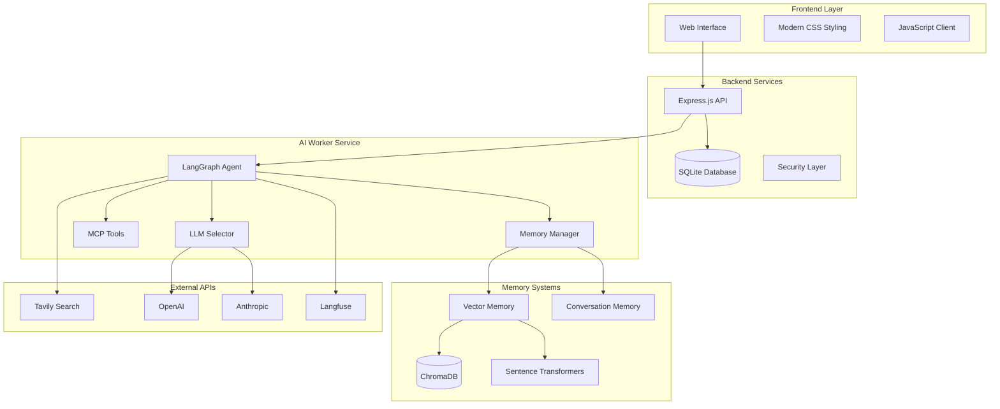

# 🛡️ Advanced OSINT Intelligence Platform

[](https://www.python.org/downloads/release/python-3120/)
[](https://nodejs.org/)
[](https://fastapi.tiangolo.com/)
[](https://expressjs.com/)
[](https://langchain-ai.github.io/langgraph/)
[](https://opensource.org/licenses/MIT)

> **An enterprise-grade OSINT (Open Source Intelligence) platform combining AI agents, multi-source data collection, vector memory systems, and comprehensive verification capabilities.**

## 📋 Table of Contents

- [🎯 Overview](#-overview)
- [✨ Key Features](#-key-features)
- [🏗️ Architecture](#️-architecture)
- [🚀 Quick Start](#-quick-start)
- [📦 Installation](#-installation)
- [⚙️ Configuration](#️-configuration)
- [🔧 Usage](#-usage)
- [🛠️ Development](#️-development)
- [📊 API Reference](#-api-reference)
- [🧪 Testing](#-testing)
- [🔒 Security](#-security)
- [📚 Documentation](#-documentation)
- [🤝 Contributing](#-contributing)
- [📄 License](#-license)

## 🎯 Overview

The Advanced OSINT Intelligence Platform is a comprehensive solution for conducting automated open source intelligence investigations. It combines multiple AI agents, sophisticated memory systems, and extensive verification capabilities to provide reliable and actionable intelligence.

### Core Components

- **🤖 FastAPI AI Worker**: Python-based intelligent agent system using LangGraph
- **🌐 Express.js Backend**: Node.js API server with SQLite database and security features
- **💻 Frontend Interface**: Modern web interface for investigation management
- **🧠 Vector Memory System**: Advanced semantic memory with ChromaDB and embeddings
- **🔧 MCP Tools**: Model Context Protocol tools for specialized OSINT operations

## ✨ Key Features

### 🎯 **Intelligent Investigation**
- **Multi-Agent Architecture**: Specialized agents for data collection, verification, and synthesis
- **LangGraph Workflows**: Sophisticated agent orchestration and state management
- **Adaptive Planning**: Dynamic investigation strategies based on initial findings
- **Confidence Scoring**: Multi-factor assessment with uncertainty quantification

### 🔍 **Multi-Source Intelligence**
- **Search Engines**: Tavily, Google, Bing, DuckDuckGo integration
- **Network Analysis**: WHOIS, DNS, subdomain enumeration
- **Social Media**: Profile analysis and content verification
- **Image Intelligence**: Metadata extraction and reverse image search
- **Document Analysis**: PDF, Office documents, and text processing

### 🧠 **Advanced Memory System**
- **Vector Memory**: Semantic similarity search with ChromaDB
- **Conversation Memory**: Context-aware dialogue management
- **Investigation History**: Complete audit trail and case management
- **Knowledge Graphs**: Entity relationship mapping and visualization

### 🛡️ **Security & Privacy**
- **PII Detection**: Automatic detection and redaction of sensitive information
- **Rate Limiting**: Protection against abuse and API quota management
- **Secure APIs**: Authentication, validation, and encrypted communication
- **Audit Logging**: Comprehensive security event tracking

### 📊 **Monitoring & Analytics**
- **Real-time Tracking**: Live investigation progress with Langfuse
- **Performance Metrics**: System health and operation statistics
- **Error Handling**: Robust error recovery and graceful degradation
- **Export Capabilities**: Multiple formats for investigation reports

## 🏗️ Architecture



### Component Responsibilities

| Component | Purpose | Technology Stack |
|-----------|---------|------------------|
| **Frontend** | User interface and visualization | HTML5, CSS3, Vanilla JavaScript |
| **Express Backend** | API server, database, security | Node.js, Express.js, SQLite3 |
| **FastAPI AI Worker** | Agent execution, AI processing | Python 3.12, FastAPI, LangGraph |
| **Vector Memory** | Semantic search and storage | ChromaDB, Sentence Transformers |
| **MCP Tools** | Specialized OSINT operations | Custom Python modules |

## 🚀 Quick Start

### Prerequisites

- **Python 3.12** (exact version required)
- **Node.js 18+** and npm 9+
- **Git** for version control
- **API Keys**: OpenAI, Anthropic, Tavily (optional but recommended)

### 1. Clone and Setup

```bash
# Clone the repository
git clone https://github.com/your-org/osint-app.git
cd osint-app

# Create Python virtual environment
python3.12 -m venv venv
source venv/bin/activate  # On Windows: venv\Scripts\activate

# Install Python dependencies
cd fastapi-ai-worker
pip install -e .

# Install Node.js dependencies
cd ../express-backend
npm install
```

### 2. Environment Configuration

```bash
# Copy environment templates
cp fastapi-ai-worker/.env.example fastapi-ai-worker/.env
cp express-backend/.env.example express-backend/.env

# Edit configuration files
nano fastapi-ai-worker/.env  # Add your API keys
nano express-backend/.env    # Configure backend settings
```

### 3. Start Services

```bash
# Terminal 1: Start FastAPI AI Worker
cd fastapi-ai-worker
uvicorn app.main:app --reload --port 8001

# Terminal 2: Start Express Backend
cd express-backend
npm run dev

# Terminal 3: Serve Frontend (optional - or use a simple HTTP server)
cd frontend
python -m http.server 8080
```

### 4. Access the Application

- **Frontend**: http://localhost:8080
- **Express API**: http://localhost:3000
- **FastAPI Docs**: http://localhost:8001/docs
- **Health Check**: http://localhost:3000/health

## 📦 Installation

### Detailed Installation Steps

#### 1. System Requirements

```bash
# Verify Python version
python3.12 --version  # Should be 3.12.x

# Verify Node.js version
node --version  # Should be v18.x.x or higher
npm --version   # Should be 9.x.x or higher
```

#### 2. Python Environment Setup

```bash
# Create isolated environment
python3.12 -m venv osint-env
source osint-env/bin/activate

# Upgrade pip and install build tools
pip install --upgrade pip setuptools wheel

# Install the FastAPI AI Worker
cd fastapi-ai-worker
pip install -e .

# Verify installation
python -c "import app; print('FastAPI worker installed successfully')"
```

#### 3. Node.js Backend Setup

```bash
cd express-backend

# Clean install
rm -rf node_modules package-lock.json
npm install

# Run security audit
npm audit fix

# Verify installation
npm test
```

#### 4. Database Initialization

```bash
# Create database and run migrations
cd express-backend
npm run db:migrate

# Optional: Seed with sample data
npm run db:seed
```

#### 5. Frontend Setup

```bash
cd frontend

# No build process required for vanilla JavaScript
# Serve using any static file server:

# Option 1: Python HTTP server
python -m http.server 8080

# Option 2: Node.js http-server (install globally)
npm install -g http-server
http-server -p 8080

# Option 3: Use backend to serve static files (already configured)
# Frontend accessible at http://localhost:3000/static/
```

## ⚙️ Configuration

### Environment Variables

#### FastAPI AI Worker (.env)

```bash
# Core Configuration
ENVIRONMENT=development
DEBUG=true
LOG_LEVEL=INFO

# API Keys
OPENAI_API_KEY=sk-your-openai-key
ANTHROPIC_API_KEY=sk-ant-your-anthropic-key
TAVILY_API_KEY=tvly-your-tavily-key

# Model Configuration
DEFAULT_MODEL=gpt-4o
DEFAULT_TEMPERATURE=0.1
MAX_TOKENS=4000

# Memory Configuration
VECTOR_DB_PATH=./data/vector_db
ENABLE_MEMORY_PERSISTENCE=true
MEMORY_SIMILARITY_THRESHOLD=0.7

# Search Configuration
MAX_SEARCH_RESULTS=20
SEARCH_TIMEOUT=30
ENABLED_SEARCH_SOURCES=tavily,whois,dns

# Rate Limiting
RATE_LIMIT_REQUESTS=100
RATE_LIMIT_WINDOW=900

# Langfuse Tracking (Optional)
LANGFUSE_SECRET_KEY=sk-lf-your-key
LANGFUSE_PUBLIC_KEY=pk-lf-your-key
LANGFUSE_HOST=https://cloud.langfuse.com
ENABLE_LANGFUSE_TRACKING=true
```

#### Express Backend (.env)

```bash
# Server Configuration
NODE_ENV=development
PORT=3000
HOST=localhost

# Database
DATABASE_PATH=./data/osint.db
DATABASE_POOL_SIZE=20

# Security
JWT_SECRET=your-super-secret-jwt-key
BCRYPT_ROUNDS=12
SESSION_SECRET=your-session-secret

# CORS
CORS_ORIGIN=http://localhost:8080
CORS_CREDENTIALS=true

# Rate Limiting
RATE_LIMIT_WINDOW_MS=900000
RATE_LIMIT_MAX_REQUESTS=100

# AI Worker Integration
AI_WORKER_URL=http://localhost:8001
AI_WORKER_TIMEOUT=120000

# Monitoring
ENABLE_REQUEST_LOGGING=true
ENABLE_PERFORMANCE_MONITORING=true
```

### Advanced Configuration

#### Model Selection Strategy

```python
# fastapi-ai-worker/app/config.py
MODEL_CONFIG = {
    "fast": {
        "model": "gpt-4o-mini",
        "temperature": 0.1,
        "max_tokens": 2000
    },
    "balanced": {
        "model": "gpt-4o",
        "temperature": 0.3,
        "max_tokens": 4000
    },
    "creative": {
        "model": "claude-3-sonnet-20240229",
        "temperature": 0.7,
        "max_tokens": 4000
    }
}
```

#### Search Engine Priorities

```python
# Priority-based search engine selection
SEARCH_ENGINE_CONFIG = {
    "web_search": ["tavily", "duckduckgo"],
    "domain_intel": ["whois", "dns"],
    "social_media": ["tavily"],
    "image_search": ["tavily"]
}
```

## 🔧 Usage

### Basic Investigation Workflow

#### 1. Web Interface Usage

1. **Open the application** in your browser at `http://localhost:8080`
2. **Select AI model** and adjust creativity settings
3. **Enter investigation topic**: Be specific about what you want to investigate
4. **Start investigation**: Click "Start OSINT Investigation"
5. **Monitor progress**: Watch real-time updates in the status section
6. **Review findings**: Examine the intelligence assessment
7. **Approve or reject**: Store valuable findings in memory

#### 2. API Usage Examples

##### Start Investigation via API

```bash
curl -X POST http://localhost:3000/api/agent/start \
  -H "Content-Type: application/json" \
  -d '{
    "topic": "Cybersecurity assessment of example.com",
    "model_id": "gpt-4o",
    "temperature": 0.3
  }'
```

##### Check Investigation Status

```bash
curl -X GET http://localhost:3000/api/cases/case-123/status
```

##### Submit Feedback

```bash
curl -X POST http://localhost:3000/api/submit_feedback \
  -H "Content-Type: application/json" \
  -d '{
    "case_id": "case-123",
    "feedback": "approved",
    "comments": "Excellent analysis of the domain security posture"
  }'
```

#### 3. Direct Python API Usage

```python
import asyncio
from app.agent import agent_executor
from app.enhanced_agent_state import AgentState

async def run_investigation():
    # Create initial state
    state = AgentState(
        topic="Domain security analysis for suspicious-domain.com",
        case_id="inv-001",
        model_id="gpt-4o",
        long_term_memory=[],
        search_results=[],
        mcps_executed=[],
        agent_iterations=[]
    )
    
    # Execute investigation
    result = await agent_executor.ainvoke(state)
    print(f"Investigation completed: {result['final_assessment']}")

# Run the investigation
asyncio.run(run_investigation())
```

### Advanced Usage Patterns

#### 1. Custom MCP Tool Integration

```python
# Add new MCP tool
from app.mcps import register_mcp_tool

@register_mcp_tool("custom_intel")
async def custom_intelligence_tool(data: dict) -> dict:
    """Custom intelligence gathering tool"""
    target = data.get("target")
    # Your custom logic here
    return {
        "findings": f"Custom analysis of {target}",
        "confidence": 0.85,
        "metadata": {"tool": "custom_intel"}
    }
```

#### 2. Memory System Querying

```python
from app.vector_memory import VectorMemoryManager

# Initialize memory manager
memory = VectorMemoryManager()

# Search similar investigations
similar_cases = await memory.find_similar_memories(
    "Domain security analysis",
    k=5,
    min_similarity=0.7
)

# Get memory statistics
stats = await memory.get_memory_statistics()
print(f"Total memories: {stats['total_memories']}")
```

#### 3. Batch Processing

```python
# Process multiple investigations
investigations = [
    "Security assessment of domain1.com",
    "Social media profile analysis for @username",
    "IP address reputation check for 192.168.1.1"
]

for topic in investigations:
    state = AgentState(topic=topic, case_id=f"batch-{i}")
    result = await agent_executor.ainvoke(state)
    print(f"Completed: {topic}")
```

## 🛠️ Development

### Development Environment Setup

#### 1. Install Development Dependencies

```bash
# Python development tools
cd fastapi-ai-worker
pip install -e ".[dev]"

# Node.js development tools
cd express-backend
npm install --include=dev
```

#### 2. Code Quality Tools

```bash
# Python: Black, isort, flake8, mypy
cd fastapi-ai-worker
black app/
isort app/
flake8 app/
mypy app/

# Node.js: ESLint
cd express-backend
npm run lint
npm run lint:fix
```

#### 3. Pre-commit Hooks

```bash
# Install pre-commit hooks
cd fastapi-ai-worker
pre-commit install

# Run hooks manually
pre-commit run --all-files
```

### Development Workflows

#### 1. Adding New Features

```bash
# Create feature branch
git checkout -b feature/new-mcp-tool

# Make changes
# Add tests
# Update documentation

# Run tests
npm test                    # Backend tests
pytest                     # Python tests

# Commit and push
git commit -m "feat: add new MCP tool for certificate analysis"
git push origin feature/new-mcp-tool
```

#### 2. Debugging

```bash
# Python debugging with enhanced logging
export LOG_LEVEL=DEBUG
uvicorn app.main:app --reload --log-level debug

# Node.js debugging
DEBUG=* npm run dev

# Database debugging
npm run db:debug
```

#### 3. Performance Profiling

```python
# Python profiling
import cProfile
cProfile.run('agent_executor.invoke(state)', 'profile_stats.prof')

# Memory profiling
from memory_profiler import profile

@profile
def investigate_topic(topic):
    # Your investigation code
    pass
```

### Architecture Patterns

#### 1. Adding New Agent Nodes

```python
# app/agent.py
from langgraph import StateGraph

def new_analysis_node(state: AgentState) -> AgentState:
    """New analysis capability"""
    # Implementation
    return state

# Add to graph
workflow = StateGraph(AgentState)
workflow.add_node("new_analysis", new_analysis_node)
workflow.add_edge("search_intel", "new_analysis")
```

#### 2. Custom Memory Implementations

```python
# app/custom_memory.py
from app.vector_memory import BaseMemoryManager

class CustomMemoryManager(BaseMemoryManager):
    """Custom memory implementation"""
    
    async def store_investigation_memory(self, memory_data: dict):
        # Custom storage logic
        pass
    
    async def retrieve_relevant_memories(self, query: str):
        # Custom retrieval logic
        pass
```

## 📊 API Reference

### FastAPI AI Worker Endpoints

#### Core Investigation API

##### POST `/agent/start`
Start a new OSINT investigation.

**Request Body:**
```json
{
  "topic": "string",
  "model_id": "string",
  "temperature": 0.3,
  "case_id": "string (optional)"
}
```

**Response:**
```json
{
  "case_id": "string",
  "status": "started",
  "stream_url": "/agent/stream/{case_id}"
}
```

##### GET `/agent/stream/{case_id}`
Stream real-time investigation progress.

**Response:** Server-Sent Events stream with JSON payloads.

##### GET `/agent/status/{case_id}`
Get investigation status.

**Response:**
```json
{
  "case_id": "string",
  "status": "completed|running|failed",
  "progress": 0.75,
  "current_step": "string",
  "findings": {...}
}
```

#### Memory Management API

##### POST `/memory/store`
Store investigation results in vector memory.

**Request Body:**
```json
{
  "case_id": "string",
  "findings": {...},
  "metadata": {...}
}
```

##### GET `/memory/search`
Search similar investigations.

**Query Parameters:**
- `query`: Search query string
- `k`: Number of results (default: 5)
- `threshold`: Similarity threshold (default: 0.7)

#### Models and Configuration

##### GET `/models/available`
Get available LLM models.

**Response:**
```json
{
  "models": [
    {
      "id": "gpt-4o",
      "name": "GPT-4 Optimized",
      "provider": "openai",
      "capabilities": ["text", "reasoning"]
    }
  ]
}
```

### Express Backend Endpoints

#### Investigation Management

##### GET `/api/cases`
List all investigation cases.

**Query Parameters:**
- `page`: Page number
- `limit`: Results per page
- `status`: Filter by status

##### GET `/api/cases/{case_id}`
Get specific case details.

##### POST `/api/cases/{case_id}/feedback`
Submit feedback for a case.

#### System Management

##### GET `/health`
System health check.

**Response:**
```json
{
  "status": "healthy",
  "timestamp": "2024-01-01T00:00:00Z",
  "services": {
    "database": "healthy",
    "ai_worker": "healthy"
  },
  "version": "1.0.0"
}
```

##### GET `/api/statistics`
Get system statistics.

**Response:**
```json
{
  "total_cases": 150,
  "active_investigations": 3,
  "success_rate": 0.95,
  "avg_processing_time": 45.2
}
```

## 🧪 Testing

### Test Organization

```
fastapi-ai-worker/
├── tests/
│   ├── unit/
│   │   ├── test_agent.py
│   │   ├── test_vector_memory.py
│   │   └── test_mcps.py
│   ├── integration/
│   │   ├── test_agent_workflows.py
│   │   └── test_memory_integration.py
│   └── fixtures/
│       └── test_data.py

express-backend/
├── tests/
│   ├── unit/
│   │   └── database.test.js
│   └── integration/
│       └── api.test.js
```

### Running Tests

#### Python Tests

```bash
cd fastapi-ai-worker

# Run all tests
pytest

# Run with coverage
pytest --cov=app --cov-report=html

# Run specific test categories
pytest tests/unit/
pytest tests/integration/

# Run performance tests
pytest tests/performance/ -v

# Run with markers
pytest -m "not slow"  # Skip slow tests
```

#### Node.js Tests

```bash
cd express-backend

# Run all tests
npm test

# Run specific test suites
npm run test:unit
npm run test:integration

# Run with coverage
npm run test:coverage

# Watch mode for development
npm run test:watch
```

### Test Examples

#### Unit Testing - Vector Memory

```python
# tests/unit/test_vector_memory.py
import pytest
from app.vector_memory import VectorMemoryManager

@pytest.mark.asyncio
async def test_memory_storage_and_retrieval():
    """Test basic memory storage and retrieval"""
    memory = VectorMemoryManager()
    
    # Store test memory
    test_data = {
        "investigation": "Domain security test",
        "findings": {"security_score": 85},
        "confidence": 0.9
    }
    
    memory_id = await memory.store_investigation_memory(test_data)
    assert memory_id is not None
    
    # Retrieve similar memories
    similar = await memory.find_similar_memories(
        "Domain security analysis", k=1
    )
    
    assert len(similar) > 0
    assert similar[0]["similarity_score"] > 0.5
```

#### Integration Testing - Agent Workflow

```python
# tests/integration/test_agent_workflows.py
@pytest.mark.asyncio
async def test_complete_investigation_workflow():
    """Test end-to-end investigation workflow"""
    # Mock external APIs
    with patch('app.mcps.search_tavily') as mock_search:
        mock_search.return_value = {"results": [{"title": "Test"}]}
        
        # Execute investigation
        state = AgentState(
            topic="Test investigation",
            case_id="test-001",
            model_id="gpt-4o"
        )
        
        result = await agent_executor.ainvoke(state)
        
        # Verify results
        assert result["status"] == "completed"
        assert "final_assessment" in result
        assert len(result["search_results"]) > 0
```

#### API Integration Testing

```javascript
// tests/integration/api.test.js
const request = require('supertest');
const app = require('../../server');

describe('OSINT API Integration', () => {
  test('POST /api/agent/start should initiate investigation', async () => {
    const response = await request(app)
      .post('/api/agent/start')
      .send({
        topic: 'Test investigation',
        model_id: 'gpt-4o',
        temperature: 0.3
      })
      .expect(200);
    
    expect(response.body).toHaveProperty('case_id');
    expect(response.body.status).toBe('started');
  });
  
  test('GET /health should return system status', async () => {
    const response = await request(app)
      .get('/health')
      .expect(200);
    
    expect(response.body.status).toBe('healthy');
    expect(response.body).toHaveProperty('services');
  });
});
```

### Test Data and Fixtures

```python
# tests/fixtures/test_data.py
@pytest.fixture
def sample_investigation_state():
    """Sample investigation state for testing"""
    return AgentState(
        topic="Test cybersecurity assessment",
        case_id="test-case-001",
        model_id="gpt-4o",
        temperature=0.3,
        long_term_memory=[],
        search_results=[],
        mcps_executed=[],
        agent_iterations=[]
    )

@pytest.fixture
def mock_search_results():
    """Mock search results for testing"""
    return {
        "tavily": [
            {
                "title": "Example Security Report",
                "url": "https://example.com/report",
                "content": "Security analysis shows...",
                "score": 0.95
            }
        ]
    }
```

## 🔒 Security

### Security Features

#### 1. Input Validation and Sanitization

```python
# Automatic PII detection and redaction
from app.security import PIIDetector

detector = PIIDetector()
cleaned_text, detected_types = detector.detect_and_redact(user_input)

if detected_types:
    logger.warning(f"PII detected and redacted: {detected_types}")
```

#### 2. Rate Limiting

```javascript
// Express rate limiting configuration
const rateLimit = require('express-rate-limit');

const investigationRateLimit = rateLimit({
  windowMs: 15 * 60 * 1000, // 15 minutes
  max: 10, // Limit each IP to 10 investigations per window
  message: 'Too many investigations started from this IP'
});

app.use('/api/agent/start', investigationRateLimit);
```

#### 3. API Security

```javascript
// Security headers and CORS
app.use(helmet({
  contentSecurityPolicy: {
    directives: {
      defaultSrc: ["'self'"],
      scriptSrc: ["'self'", "'unsafe-inline'"],
      styleSrc: ["'self'", "'unsafe-inline'"]
    }
  }
}));
```

### Security Best Practices

#### 1. Environment Variables

```bash
# Use strong, unique secrets
JWT_SECRET=$(openssl rand -base64 32)
SESSION_SECRET=$(openssl rand -base64 32)

# Rotate API keys regularly
OPENAI_API_KEY=sk-new-rotated-key
```

#### 2. Database Security

```sql
-- Use parameterized queries (already implemented)
SELECT * FROM investigations WHERE case_id = ? AND user_id = ?;

-- Regular backup strategy
PRAGMA wal_checkpoint(FULL);
```

#### 3. Logging and Monitoring

```python
# Security event logging
import structlog

security_logger = structlog.get_logger("security")

async def log_security_event(event_type: str, details: dict):
    """Log security-related events"""
    security_logger.warning(
        "Security event detected",
        event_type=event_type,
        timestamp=time.time(),
        **details
    )
```

## 📚 Documentation

### Additional Documentation

- **[API Documentation](http://localhost:8001/docs)**: Interactive FastAPI documentation
- **[Backend API Guide](express-backend/README.md)**: Express.js backend details
- **[Vector Memory System](fastapi-ai-worker/VECTOR_MEMORY_BUG_FIXES.md)**: Memory system implementation
- **[Testing Guide](fastapi-ai-worker/TESTING_SUMMARY.md)**: Comprehensive testing information
- **[Improvement Roadmap](INTEGRATED_IMPROVEMENT_SUGGESTIONS.md)**: Future enhancement plans

### Generating Documentation

```bash
# Generate Python API documentation
cd fastapi-ai-worker
pip install mkdocs mkdocs-material mkdocstrings[python]
mkdocs build

# Generate Node.js documentation
cd express-backend
npm install -g jsdoc
jsdoc -c jsdoc.conf.json
```

## 🤝 Contributing

### Contribution Guidelines

1. **Fork** the repository
2. **Create** a feature branch: `git checkout -b feature/amazing-feature`
3. **Make** your changes following the coding standards
4. **Add** tests for new functionality
5. **Update** documentation as needed
6. **Run** the test suite: `npm test && pytest`
7. **Commit** your changes: `git commit -m 'feat: add amazing feature'`
8. **Push** to the branch: `git push origin feature/amazing-feature`
9. **Open** a Pull Request

### Development Standards

#### Code Style

```bash
# Python
black app/
isort app/
flake8 app/
mypy app/

# JavaScript
npm run lint:fix
```

#### Commit Message Format

```
type(scope): description

[optional body]

[optional footer]
```

**Types:** feat, fix, docs, style, refactor, test, chore

#### Testing Requirements

- All new features must include tests
- Maintain > 80% test coverage
- Integration tests for API endpoints
- Performance tests for critical paths

## 📄 License

This project is licensed under the MIT License - see the [LICENSE](LICENSE) file for details.

## 🙏 Acknowledgments

- **LangChain/LangGraph**: For the agent framework
- **FastAPI**: For the high-performance API framework
- **ChromaDB**: For vector database capabilities
- **Sentence Transformers**: For embedding generation
- **Tavily**: For intelligent search capabilities

## 📞 Support

- **Issues**: [GitHub Issues](https://github.com/your-org/osint-app/issues)
- **Discussions**: [GitHub Discussions](https://github.com/your-org/osint-app/discussions)
- **Email**: osint-support@example.com

---

**⚡ Ready to start your OSINT investigation? Follow the [Quick Start](#-quick-start) guide and begin exploring the intelligence landscape!**
